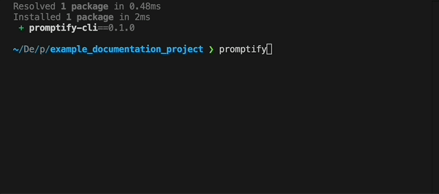

# Promptify CLI

An interactive CLI to select files, generate markdown suitable for LLM prompts, and copy it to the clipboard.

## Installation

```bash
pip install promptify-cli
```

## Demo



## Basic Usage

### Default Behavior
- `promptify` command, without any args, provides a UI to select files from the CWD to copy to your clipboard.
- respects a `.promptignore` file... identical to `.gitignore`.
- The filetree copied to the clipboard shows all files and folder expanded to a depth of 4 (omitting `.promptignore` files).
- The files selected in the UI (green) will be markdown formatted and copied with the filetree to your clipboard when finished.
- Info about LOC and Total Tokens (GPT-4o) is shown as you select files.

### Help

```bash
promptify --help
```

> | Option                 | Short | Type      | Description                       | Default |
> | ---------------------- | ----- | --------- | --------------------------------- | ------- |
> | `--depth`              | `-d`  | INTEGER   | Max directory depth (0=root only) | `4`     |
> | `--path`               | `-p`  | DIRECTORY | Starting directory path           | CWD     |
> | `--clear-state`        |       |           | Clear previous selections         |         |
> | `--install-completion` |       |           | Install shell completion          |         |
> | `--show-completion`    |       |           | Show shell completion             |         |
> | `--help`               |       |           | Show help message and exit        |         |


## Example Output (Copied to Clipboard)

````markdown
Project Structure (Depth: 4):

```
example_documentation_project/
├─ foobar/
│  └─ bar.py
├─ foo.py
└─ output.md
```

---

## File: `foo.py`

```python
def foo(bar):
    return bar

```

---

## File: `foobar/bar.py`

```python
def bar(foo):
    return foo

```
````